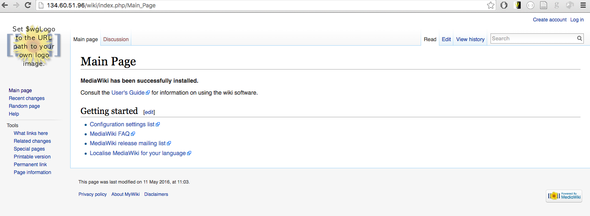

# Lesson 1: OpenStack Basics

## Question: Hypervisors and Virtual Machines

*What are the basic tasks of a hypervisor?*

A hypervisor (sometimes "virtual machine monitor" or VMM) manages physical
hardware and divides it into usually smaller virtual hardware, used by virtual
machines. Type-1 and Type-2 hypervisors differ in their location (Type 1 runs on
bare metal, Type 2 runs on top of an operating system). Examples: XEN (Type 1), KVM (Type 2 but since part of operating system close to Type 1), VirtualBox (Type 2).

```
                               +------+------+
                               |      |      |
+------+------+------+         |  VM  |  VM  |
|      |      |      |  +------+      |      |
|  VM  |  VM  |  VM  |  |      |      |      |
|      |      |      |  | App  +------+------+
|      |      |      |  |      |  Hypervisor |
+-------------+------+  +------+-------------+
| Hypervisor (Type 1)|  |  Operating System  |
+--------------------+  +--------------------+
|                    |  |                    |
|      Hardware      |  |      Hardware      |
|                    |  |                    |
+--------------------+  +--------------------+

```

*What are benefits / drawbacks of using virtual machines compared to physical servers?*

- Drawback: Virtualisation costs performance and may lead to resource interference when more than one VM is hosted
- Benefit: virtual machine is abstracted from hardware and can be freely moved between hardware

# Lesson 2: First Steps with Omistack

## Task: Launch your first Instance

Your first instance in Openstack should look like follows:


# Lesson 3: Install Mediawiki Application

The setup looks as follows at the moment: one virtual machine, based on an Ubuntu 14.04 operating system, with an Apache2 web server and a MariaDB database server.

```
             +------------------+Virtual Machine+------------+
             |      Ubuntu 14.04                             |
             |     +----------------+  +-----------------+   |
             +     |                |  |                 |   |
http://publicIP:80 |   Apache2      |  |   MariaDB       |   |
             +     |   + PHP        |  |   Database      |   |
         +---------->  + Mediawiki +----->               |   |
             |     |                |  |                 |   |
             |     |  Port          |  |   Port          |   |
             |     |  TCP 80        |  |   TCP 3306      |   |
             |     +----------------+  +-----------------+   |
             +-----------------------------------------------+
```

The ready Mediawiki installation looks like follows:



## Question: One Instance for Database and Application

**Pro:**

 - connection via 127.0.0.1 is fast
 - Traffic does not leave the host
 - high bandwidth, low latency

**Con:**

 - Scalability is limited, since database is bound to application
 - Apache2 and mariaDB have to run on the same node 
 - DB and Web server have different resource demand (CPU vs Memory/Disk)


**Alternative:**

 - Move database to separate host
 - Connect apache2 via TCP
 - Scale horizontally by adding more web servers
